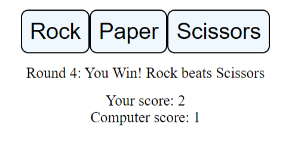

# odin-rock-paper-scissors

## Description

The goal of this project is to create a simple rock paper scissors game where the player plays against a program. The project uses a GUI to let player make their choice and to tell the user useful information about how things are going for them.

The program will be coded in JS with a bit of HTML to make the webpage and CSS is used to lightly style the project. All elements inside the body tag are made using JavaScript to practice using it to manipulate and create elements.

## Layout

Deployment: [here](https://juhalo.github.io/odin-rock-paper-scissors/)

The general look is below:

## Credits

Link to the original github page of the project (without the GUI) by theodinproject is [here](https://github.com/TheOdinProject/curriculum/blob/main/foundations/javascript_basics/project_rock_paper_scissors.md).
Link to the original project with GUI by theodinproject is [here](https://github.com/TheOdinProject/curriculum/blob/main/foundations/javascript_basics/revisiting_rock_paper_scissors.md).
